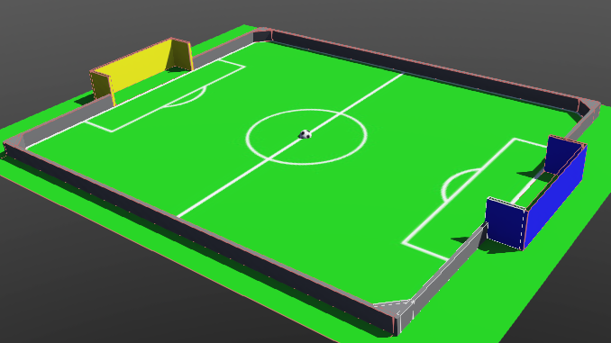
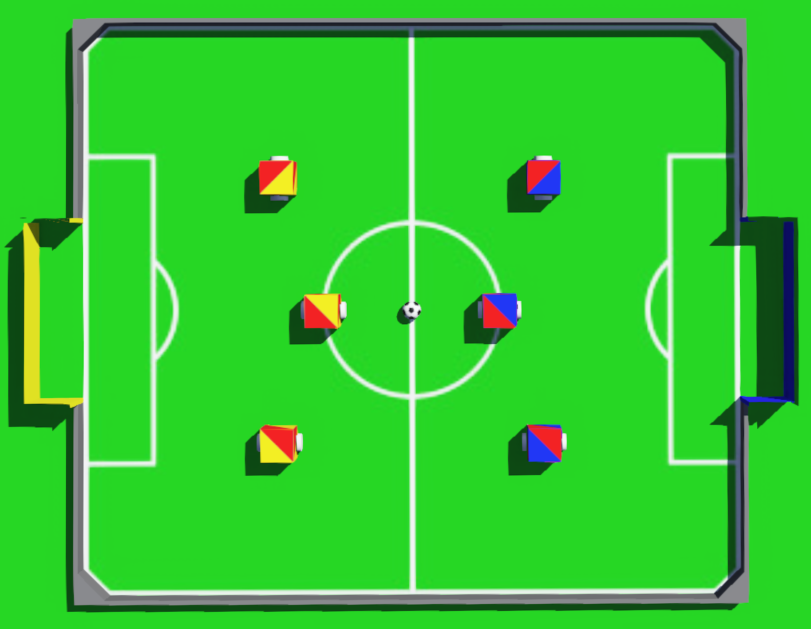

= RoboCupJunior Soccer Simulation Rules January 2021
{docdate}
:toc: left
:sectanchors:
:sectlinks:
:xrefstyle: full
:section-refsig: Rule
:sectnums:

ifdef::basebackend-html[]
++++
<link rel="stylesheet" href="https://use.fontawesome.com/releases/v5.3.1/css/all.css" integrity="sha384-mzrmE5qonljUremFsqc01SB46JvROS7bZs3IO2EmfFsd15uHvIt+Y8vEf7N7fWAU" crossorigin="anonymous">

++++
endif::basebackend-html[]

:icons: font
:numbered:

These are the official Soccer Simulation rules for *the RoboCupJunior 2021*.
They are released by the RoboCupJunior Soccer Technical Committee (TC).
The English version of these rules has priority over any translations.

Teams are advised to check the RoboCupJunior Soccer site
https://junior.forum.robocup.org/ for OC (Organizational Committee) procedures
and requirements for the international competition. Each team is responsible
for verifying the latest version of the rules prior to competition.
footnote:[The current version of these rules can be found at
https://robocupjuniortc.github.io/soccer-rules-simulation/rules.html in HTML form
and at https://robocupjuniortc.github.io/soccer-rules-simulation/rules.pdf in PDF
form.]

Instructions on the Webots environment, on how to program controllers, as well as demos
and tutorials can be found online at https://robocupjuniortc.github.io/rcj-soccer-sim/.

[title="Two teams of three robots in a simulated RoboCupJunior Soccer match."]
image::media/soccer_sim.png[width=350]

NOTE: This is the final version of the rules for the RCJ Soccer Simulation Challenge 2021.
This version differs only slightly from the drafts published earlier this year.

[discrete]
== Preface

In the RoboCupJunior Soccer Simulation challenge, teams of young engineers program
three fully autonomous digital robots to compete against another team
in simulated matches. The robots must detect a ball and score into a color-coded
goal on a special field that resembles a human soccer field.

To be successful, participants must demonstrate special programming skills.
Teams are also expected to contribute to the advancement of the community as a
whole by sharing their discoveries with other participants and by engaging in good
sportsmanship, regardless of culture, age or result in the competition.
*All are expected to compete, learn, have fun, and grow.*

_The RoboCupJunior Soccer Simulation Challenge is a special addition to the existing
RoboCupJunior Soccer Leagues. There is no need to meet in person for the RoboCupJunior
Simulation Challenge. It was created primarily for the
2021 season. There is no guarantee for continuing it throughout later seasons.
However, depending on the results and feedback from the community, there might be
future RoboCupJunior Soccer Simulation challenges and leagues._

[discrete]
=== Programming has to be performed exclusively by the students

Robots must be programmed exclusively by student members of the team. Mentors,
teachers, parents or companies should not be involved in the
software design, programming or debugging of robots. To avoid
embarrassment and possible disqualification, it is extremely important that
teams abide by all other competition’s rules.

If in doubt, please consult with your Regional Representative before
registering your team.

[[gameplay]]
== GAMEPLAY

[[game-procedure-and-length-of-a-game]]
=== Game Procedure and Length of a Game

RCJ Soccer games consist of two teams of robots playing soccer against each
other. Each team has three autonomous robots. The game will consist of two
halves. The duration of each half is 10 minutes.

The game will be timed by an artificial referee program. The referee will make
all the decisions during the game automatically, including the placement of
the ball and of robots. There will be no discussion on decisions the artificial
referee took.

[[pre-match-programming]]
=== Pre-Match Programming

Teams will send their code to the organization committee (OC) before the competition.
The matches will then be conducted by the OC, which will run the code of the teams
against each other. The matches will either be pre-recorded, or streamed live
via an online streaming service.

[[pre-match-meeting]]
=== Pre-Match Meeting

At the start of the first half of the game, the artificial referee will choose the team
kicking off at random, as well as the goal they will kick towards. After the first half, teams switch sides.
The team not kicking off in the first half of the game will kick off to begin
the second half of the game.

[[kick-off]]
=== Kick-Off

Each half of the game begins with a kick-off. All robots will be positioned by the artificial referee on
their own side of the field and halted. The ball is positioned 
by the artificial referee in the center of the field. All robots on the team not
kicking off will be outside of the center circle.

On the artificial referee's command, all robots will be started immediately.

[[neutral-kickoff]]
==== Neutral Kick-Off

A neutral kick-off is the same as the one described in <<kick-off>> with a
small change: all robots must be placed outside of the center circle.

[[human-interference]]
=== Human Interference

Except for starting or stopping the simulation, human interference during the
simulated matches is not permitted, neither by teams nor by the OC.
All decisions and actions are taken by the robots' programs
and the artificial referee autonomously.

[[ball-movement]]
=== Ball Movement

A robot cannot hold the ball.

[[scoring]]
=== Scoring

The artificial referee will consider a goal as being scored as soon as the ball crosses the goal line.

Goals scored either by an attacking or defending robot have the same end
result: they give one goal to the team on the opposite side.  After a goal, the
game will be restarted with a kick-off from the team who was scored against.

[[inside-penalty-area]]
=== Inside the Penalty Area

No robots are supposed to be inside any penalty area for more than 15 seconds.
After this time, they will be re-spawned on the furthest unoccupied neutral spot
facing sideways. For this rule to apply, a robot must be inside the penalty area with its center
of mass.

For the timer to be reset, the robots must be outside the penalty area for
more than 2 seconds.

[[lack-of-progress]]
=== Lack of Progress

Lack of progress occurs if there is no progress in the gameplay for a
reasonable period of time.  Typical
lack of progress situations are when the ball is stuck between robots, when
there is no change in ball and robot’s positions, or when the ball is beyond
detection or reach capability of all robots on the field.

If no significant ball movement occurs for 10 seconds, the artificial referee will call "lack of progress" and
will move the ball to {++a random unoccupied neutral spot.++} If this does not
solve the lack of progress, the referee can move the ball to a different
neutral spot.

[[out-of-bounds]]
=== Out of Bounds

There is no "Out of Bounds" rule.

{++If the ball or any robot accidentally leaves the field of play, it will be returned into play immediately,
and placed on the field according to the rules of <<lack-of-progress>>.++}

[[damaged-robots]]
=== Damaged Robots

Sometimes robots in the simulation will tip or fall over. In any case when
a robot does not move for 15 seconds, the artificial referee will re-spawn it
onto the nearest unoccupied neutral spot.

A robot that is respawned more than 3 times in a row according to this rule without moving
at all in-between is considered damaged and will be taken off the field. The
robot must remain off the field for one minute or until the next kick-off
is due. It will be placed on the free unoccupied neutral spot furthest from the ball,
facing sideways.

[[interruption-of-game-ref-interruption]]
=== Interruption of Game

In principle, a game will not be stopped.

[[team]]
== TEAM

[[team-regulations]]
=== Regulations

A team must have two, three or four members to form a RoboCupJunior team to
participate in the International event. A team member(s) and/or program(s) cannot
be shared between teams.

Each team must have a *captain*. The captain is the person responsible
for communication with the OC. The team captain should be in a position
to answer all of the OC's requests and questions. The team can replace its captain
during the competition.

[[team-violations]]
=== Violations

Teams that do not abide by the rules are not allowed to participate.

[[robots]]
== ROBOTS

[[number-of-robots-substitution]]
=== Number of Robots / Substitution

Each team must have exactly three programs for the full tournament.
footnote:[This means, each of the three robot has its own program. This can be three different
programs, or three times the same program, or anything in between.]
The substitution of  programs during the competition within the team or
with other teams is forbidden.

[[robots-control]]
=== Robot Control

The Teams will write a controller program to move the robots during the simulation.
The simulated robots have two wheels to control its movement (one on each side - differential-drive). 
The only aspect of the simulation that the program is allowed to act on is the speed of
the wheels of the robot that it is controlling. The program will be pre-written by
the teams and used for the whole competition. Substitution of the program during the 
competition or during a match is not allowed.

[[robots-interference]]
=== Interference

Teams are not allowed to interfere with the simulation in any unofficial way.
Teams may be penalized or disqualified by the OC for any attempt to influence or
work-around the artificicial referee, other team's robots, or the
simulation world's constraints.

[[communication]]
=== Communication

Robots may communicate within each team in the scope of the simulation,
as long as they abide by rule <<robots-interference>>.

Robots may not communicate with anything outside of the simulation world.

[[agility]]
=== Agility

The construction of the robots is pre-defined and part of the simulation
world. The robots will have a cubic form, two motorized wheels and no kicker.

Robots may be programmed with a controller script. They may turn in any direction, as
well as drive forward and backward anywhere on the field. There is a maximum speed defined
by the simulation. There is no mandatory behaviour required for the programs.

//[[textures]]
//=== Textures

//Robots can have customized textures. These textures cannot be transparent or carpet-green.

[[field]]
== FIELD

The playing field will be provided by the OC as a digital Webots world, along with
a small tutorial on how to place and move the robots during the game, as well as
measure the robot and ball positions.

[title="An empty field with its reference frame in the center: X (red) and Y (blue)."]

[[neutral-spots]]
=== Neutral Spots

There are 7 neutral spots. They are defined in simulation units as follows:

[cols=4*,options=header]
|===
| *Nr.* | *Name* | *X-Coordinate* | *Y-Coordinate*
| 1 | Central Point | 0 | 0
| 2 | Blue Side | 0.2 | 0
| 3 | Blue Side | 0.3 | 0.3
| 4 | Blue Side | 0.3 | -0.3
| 5 | Yellow Side | -0.2 | 0
| 6 | Yellow Side | -0.3 | 0.3
| 7 | Yellow Side | -0.3 | -0.3
|===

[title="The ball and the 6 robots on the 7 neutral spots as defined in <<neutral-spots>>"]

[[code-of-conduct]]
== CODE OF CONDUCT

[[fair-play]]
=== Fair Play

It is expected that the aim of all teams is to play a fair and clean game of
robot soccer.

Programs are not allowed to cause interference with other
robots or the referee during normal game play.

Programs are not allowed to cause interference to the field or to the ball during
normal game play.

[[behavior]]
=== Behavior

All participants are expected to behave themselves. All behavior
is to be of a subdued nature within the tournament.

[[help]]
=== Help

Mentors (teachers, parents, chaperones, and other adult team-members including
translators) are not allowed to work on the teams' programs.

*Mentors must not touch, build or program any programs.*

[[sharing]]
=== Sharing

The understanding that any technological and curricular developments should be
shared among the RoboCup and RoboCupJunior participants after the tournament
has been a part of world RoboCup competitions.

All the code must be shared with other participants and made open-source after
the tournament.

Also, if you find any bugs within the simulation world or the
artificial referee (except for the Webots logo), please let us know.

[[spirit]]
=== Spirit

It is expected that all participants, students, mentors, and parents will
respect the RoboCupJunior mission.

*_It is not whether you win or lose, but how much you learn that counts!_*

[[violations-disqualification]]
=== Violations / Disqualification

Teams that violate the code of conduct can be disqualified from the tournament.
It is also possible to disqualify only single person or single program from
further participation in the tournament.

In less severe cases of violations of the code of conduct, a team will be given
a warning (a yellow card). In severe or repeated cases of
violations of the code of conduct a team can be disqualified immediately
without a warning by a red card.

[[conflict-resolution]]
== CONFLICT RESOLUTION

[[referee-and-referee-assistant]]
=== Artificial Referee

During a match, the artificial referee is a program in charge of making decisions
with regards to the game and according to these rules.

During gameplay, the decisions made by the artificial referee are final.

At the conclusion of the game, the result recorded is final.

[[rule-clarification]]
=== Rule Clarification

Rule clarification may be made by members of the RoboCupJunior Soccer Technical
Committee and Organizing Committee, if necessary even during a tournament.

[[rule-modification]]
=== Rule Modification

If special circumstances, such as unforeseen problems or capabilities of a
robot occur, rules may be modified by the RoboCupJunior Soccer Organizing
Committee Chair in conjunction with available Technical Committee and
Organizing Committee members, if necessary even during a tournament.

[[regulatory-statutes]]
=== Regulatory Statutes

Each RoboCupJunior competition may have its own regulatory statutes to define
the procedure of the tournament (for example the SuperTeam system, game modes,
the inspection of programs, interviews, schedules, etc.). Regulatory statutes
become a part of this rule.

[[international-competition]]
== INTERNATIONAL COMPETITION

[[international-competition-team]]
=== Team

The maximum team size is 4 members for teams competing in the RoboCupJunior Soccer Simulation Challenge 2021.

Team members can participate independently of their participation in earlier RoboCupJunior Soccer Leagues.

[[interviews]]
=== Interviews

During the international competition, the Organizing Committee may arrange to
interview teams during the event. The exact schedule will be published by the
Organization Committee prior to the event.

During an interview, at least one member from each team must be able to explain
particularities about the team’s robots, especially with regards to its
strategy and its programming. An interviewer may ask the team for a
demonstration. The interviewer may also ask the team to write a simple program
during the interview to verify that the team is able to program its robot.

All teams are expected to be able to conduct the interview in English.  If this
poses a problem, the team may ask for a translator to be present at the
interview. If the OC is not able to provide a translator, the team is required
to do so. During the interview, the team will be evaluated using so called
Rubrics, which are published on the website mentioned in the beginning of these
rules.

The Technical Committee recommends the implementation of interviews in regional
competitions as well, but this is not mandatory.

[[poster-sessions]]
=== Poster Sessions

During the international competition, the Organizing Committee may also arrange
digital poster sessions for the teams to attend. The poster sessions will be held online.
Details will be published prior to the competition.

[[technical-challenges]]
=== Technical Challenges

Inspired by the major leagues and the need for further technological
advancement of the leagues, the Technical Committee has decided to conduct so
called *Technical Challenges*.

The idea of these challenges is to give the teams an opportunity to show off
various abilities of their robots which may not get noticed during the regular
games. Furthermore, the Technical Committee envisions these challenges to be a
place for testing new ideas that may make it to the future rules, or otherwise
shape the competition.

Any RoboCupJunior Soccer team will be eligible to try to tackle these
challenges. Unless otherwise stated, any robot taking part in these challenges
needs to abide by these rules in order to successfully complete it.

The technical challenges will be published prior to the competition, or
during competition days.
